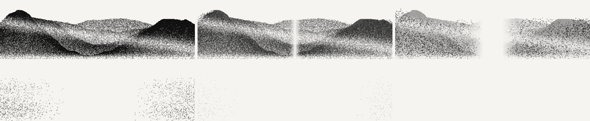

<div align="center">

# 夏祭 · 个人主页

**黑白点阵（dither）风格的极简个人主页 —— 没有一张图片素材，首屏那座山是浏览器现场算出来的。**

[](./LICENSE)
[](./package.json)
[](https://react.dev)
[](https://vite.dev)
[](./CONTRIBUTING.md)


<sub>▲ 上面这张不是截图贴的素材，而是本项目自身算法导出的真实渲染结果（分形噪声山脊 + 8×8 Bayer 有序抖动）。</sub>

</div>

---

> [!NOTE]
> 这个仓库是我的个人主页。**想拿去做成你自己的？** 直接 fork 或点 Use this template，
> 然后按下面的 [自定义](#自定义) 一节改 `src/data/site.js` 就行 —— 文案、链接、项目全在那一个文件里。

## 目录

- [这是什么](#这是什么)
- [特性](#特性)
- [快速开始](#快速开始)
- [可用命令](#可用命令)
- [项目结构](#项目结构)
- [自定义](#自定义)
- [动效清单](#动效清单)
- [关于留言便签](#关于留言便签)
- [部署](#部署)
- [浏览器支持](#浏览器支持)
- [无障碍与体验](#无障碍与体验)
- [参与贡献](#参与贡献)
- [许可证](#许可证)

## 这是什么

一个可以直接拿来改成自己主页的单页作品集模板。设计语言参考了「编辑排版 / 极简粗野主义」那一类风格：

- 米白底（`#F5F4F1`）+ 近黑墨色（`#111111`），细边框、直角、不用阴影和圆角渐变
- 大字号收紧字距的无衬线标题，配小号等宽字体做标签
- 板块之间用**斜线阴影条**（hatching）分隔，页脚做成**表格状网格**
- 主视觉是灰度点阵/噪点山景，颗粒感来自有序抖动

**技术上的两个刻意取舍：**

1. **零图片素材**。首屏山景是 `src/lib/dither.js` 用数学算出来的：分形噪声生成四层高低错落的山脊，再用 8×8 Bayer 矩阵做有序抖动，把灰度变成疏密不一的方块颗粒。好处是永远不会有"图裂了"，体积也几乎为零。
2. **山会碎成粒子**。同一份墨量数据被采样成约 5000 个独立小方块（`src/lib/particles.js`）。往下滚动时，位图从画面中线柔化裂开并淡出，粒子同时向左右两侧飞散、变小、淡出；滚回顶部会完全复原（进度直接由滚动位置驱动，所以是可逆的）。静止时每帧零开销 —— 那时看到的仍是一张静态位图。
3. **不引动画库**。所有动效都是 `IntersectionObserver` + CSS 过渡/rAF 手写的，生产包 gzip 后约 **78 kB**（含 React 本体）。

<div align="center">



<sub>▲ 下滑时山体碎成粒子的六个阶段（进度 0 → 1）。这张图同样由项目自身的代码离线渲染导出，不是截图。</sub>

</div>

## 特性

- 🏔 **程序化点阵山景** —— Canvas + 噪声 + 有序抖动，零图片素材
- 💨 **粒子化散开** —— 滚动时山体碎成约 5000 个方块粒子向两侧飞散，可逆；鼠标还能把粒子推开
- 🖱 **自定义圆圈光标** —— 跟手小黑点 + 带惯性拖尾的圆环，悬停时放大
- 🎬 **开场遮罩** —— `000 → 100%` 进度与方块标志动画
- ✨ **滚动揭示** —— 进入视口淡入上浮，逐条错落出现
- 📊 **技能条生长 + 数字滚动**、**卡片悬停 3D 倾斜**、**按钮从左侧填充**
- 📝 **留言便签墙** —— 100 字上限、存在浏览器本地、可单条撕掉
- 📱 **完整响应式** —— 桌面 / 平板 / 手机（手机自动减少粒子数）
- ♿ **尊重系统设置** —— 开启「减少动态效果」后动画全部自动关闭，山景固定为静态图
- 🧰 **开箱即用的工程化** —— ESLint 10 + Prettier + CI + Pages 自动部署 + Dependabot

## 快速开始

需要 **Node.js 20.19 以上（推荐 22 LTS）**（仓库带 `.nvmrc`，装了 nvm 的话先 `nvm use`）。

```bash
# 克隆
git clone https://github.com/Xiaji-yu/xiaji-home.git
cd xiaji-home

# 安装依赖
npm install

# 启动开发服务器
npm run dev
```

打开终端里打印的地址即可（默认 http://127.0.0.1:5173/）。改代码会自动热更新，不用重启。

## 可用命令

| 命令                   | 作用                                                  |
| ---------------------- | ----------------------------------------------------- |
| `npm run dev`          | 启动开发服务器（热更新）                              |
| `npm run build`        | 生产构建，产物在 `dist/`                              |
| `npm run preview`      | 本地预览构建产物                                      |
| `npm run lint`         | ESLint 检查                                           |
| `npm run lint:fix`     | ESLint 自动修复                                       |
| `npm run format`       | Prettier 格式化全仓库                                 |
| `npm run format:check` | 只检查格式，不改文件（CI 用）                         |
| `npm run check`        | `lint` + `format:check` + `build`，**提 PR 前跑这个** |

## 项目结构

```
xiaji-home/
├─ index.html                  页面外壳、字体引入、浏览器标签图标（内联 SVG）
├─ vite.config.js              Vite 配置（含 GitHub Pages 的 BASE_PATH 支持）
├─ eslint.config.js            ESLint 扁平配置
├─ .prettierrc.json            代码风格：2 空格 / 单引号 / 不加分号
├─ .github/
│  ├─ workflows/ci.yml         推送与 PR 时跑 lint + 格式 + 构建
│  ├─ workflows/deploy-pages.yml  自动部署到 GitHub Pages
│  ├─ ISSUE_TEMPLATE/          问题模板（bug / 功能建议）
│  └─ PULL_REQUEST_TEMPLATE.md
├─ docs/preview-mountain.png   README 顶部那张山景图
├─ docs/preview-particles.png  README 里那张散开序列图
└─ src/
   ├─ main.jsx                 入口
   ├─ App.jsx                  板块顺序，想调整页面结构就改这里
   ├─ data/site.js             ★ 全站文案，改内容只改这一个文件
   ├─ lib/dither.js            山景算法：噪声 + Bayer 抖动（决定"山长什么样"）
   ├─ lib/particles.js         粒子：采样、散开位移、淡出缩小（纯函数，可离线渲染验证）
   ├─ hooks/                   useReveal / useInView / useCountUp
   ├─ styles/
   │  ├─ tokens.css            设计变量：颜色、字体、间距、缓动曲线
   │  └─ base.css              全局排版、按钮、分节标题、斜线条、揭示动画
   └─ components/              每个板块一个组件，各自带同名 CSS
      ├─ Preloader / Cursor     开场遮罩、自定义光标
      ├─ Nav / Hero / ParticleMountain
      ├─ About / Skills / Projects / Timeline
      ├─ Contact / Notes / Footer
      └─ Reveal.jsx             滚动淡入的包装组件
```

## 自定义

### 换文案（最常做的事）

**只改 `src/data/site.js`。** 姓名、座右铭、技能、项目、经历、联系方式、页脚链接全在里面。文件里凡是标了 `← 换成你的` 的地方都是占位内容。

想调整板块的先后顺序，改 `src/App.jsx` 里那几行的位置即可。

### 换配色 / 字体

改 `src/styles/tokens.css`：

```css
:root {
  --paper: #f5f4f1; /* 页面底色 */
  --ink: #111111; /* 文字与描边 */
  --muted: #8a8782; /* 次要信息 */
  --sans: 'Inter', ...;
  --mono: 'JetBrains Mono', ...;
}
```

把 `--paper` 和 `--ink` 两个值换掉，整站跟着变。字体是在 `index.html` 里通过 Google Fonts 引入的；如果打不开它，页面会自动回退到系统字体，不会排版崩坏。想彻底不联网，删掉那三行 `<link>` 即可。

### 换掉点阵山景的样子

`src/lib/dither.js` 顶部的 `LAYERS` 就是"山"本身：

```js
{ dark: 1.0, seed: 151, freq: 3.0, amp: 0.09,
  peaks: [[0.82, 0.09, 0.2], [0.7, 0.88, 0.24]] }
//        └高度 └中心 └宽度  —— 左右各一座山头
```

- `dark` 越大越黑（越靠前）
- `peaks` 里每项是 `[山头高度, 中心位置, 宽度]`，`高度: 0` 是平地、`0.82` 代表山脊顶到画面上方 18% 处
- `amp` 是山脊的破碎程度，`seed` 换个数字就是完全不同的山形

改完直接看效果，不需要跑构建。

### 调整粒子散开的手感

`src/lib/particles.js` 顶部的几个常量：

| 常量                              | 作用                                            |
| --------------------------------- | ----------------------------------------------- |
| `TARGET_DESKTOP` / `TARGET_SMALL` | 桌面 / 手机的目标粒子数（越多越密，也越吃性能） |
| `SIZE_FACTOR`                     | 粒子边长 = 格子边长 × 它                        |
| `MOUSE_RADIUS` / `MOUSE_PUSH`     | 鼠标推开粒子的半径与最大推距                    |

散开的"力度、方向、淡出、缩小"集中在 `particleTransform()` 里，位图的裂开与淡出节奏在
`components/ParticleMountain.jsx` 顶部的 `GAP_MAX` / `GAP_FEATHER` / `RASTER_FADE_AT`。

> 这两个文件里的数学都是**纯函数**（不碰 DOM、不碰 canvas），所以可以直接在 Node 里
> 跑任意进度把它渲染成图片来对着调 —— 仓库开发时就是这么验证效果的。

## 动效清单

| 动效                                      | 在哪实现                                                |
| ----------------------------------------- | ------------------------------------------------------- |
| 开场遮罩（进度 + 方块标志，然后整块上滑） | `components/Preloader.jsx`                              |
| 自定义圆圈光标                            | `components/Cursor.jsx`                                 |
| 首屏大标题逐行推入                        | `Hero.css` 的 `@keyframes heroLine`                     |
| 山景与标题的鼠标视差                      | `components/Hero.jsx`（rAF + 插值；首屏离开视野自动停） |
| **粒子山景：滚动时向两侧散开（可逆）**    | `components/ParticleMountain.jsx` + `lib/particles.js`  |
| 滚动淡入上浮                              | `components/Reveal.jsx` + `hooks/useReveal.js`          |
| 按钮 / 联系方式卡片左侧填充               | `base.css` 的 `.btn::before`、`Contact.css`             |
| 技能条生长 + 数字滚动                     | `components/Skills.jsx` + `hooks/useCountUp.js`         |
| 项目卡片 3D 倾斜                          | `components/Projects.jsx`                               |
| 页脚斜线阴影条流动                        | `base.css` 的 `@keyframes hatchFlow`                    |

## 关于留言便签

便签存在**访问者自己的浏览器**里（`localStorage`，键名 `xiaji-notes-v1`）：

- 刷新、关闭重开都还在；单条最多 100 字；最多存 60 张；点 `×` 可撕掉
- **别人看不到你写的，你也看不到别人写的** —— 因为这是纯静态页面，没有服务器
- 想做成真正多人共享的留言板，需要加一个后端（Supabase / Cloudflare Workers 等），那是另一个工程

清空全部便签：浏览器 F12 → Application → Local Storage → 删掉 `xiaji-notes-v1`。

## 部署

### GitHub Pages（仓库已配好，推上去就行）

1. 把代码推到 GitHub 的 `main` 分支
2. 仓库 **Settings → Pages → Build and deployment → Source** 选择 **GitHub Actions**
3. 之后每次推送到 `main`，`.github/workflows/deploy-pages.yml` 会自动构建并发布
4. 地址是 `https://<你的用户名>.github.io/xiaji-home/`

> 项目页的资源路径前缀必须带仓库名。工作流里已经用 `BASE_PATH=/${{ github.event.repository.name }}/` 自动处理了，
> 对应的读取逻辑在 `vite.config.js`。如果你用的是「用户主页仓库」（仓库名形如 `<用户名>.github.io`），
> 把工作流里那行 `BASE_PATH` 删掉即可。

### Vercel / Netlify / Cloudflare Pages

导入这个仓库，构建设置填：

| 项               | 值              |
| ---------------- | --------------- |
| Build command    | `npm run build` |
| Output directory | `dist`          |
| Node version     | 20 或以上       |

这种托管不需要 `BASE_PATH`（站点在根路径）。

## 浏览器支持

面向所有支持 ES2020 与 `IntersectionObserver` 的现代浏览器：Chrome / Edge 90+、Firefox 88+、Safari 14+。

两个降级行为：

- `image-rendering: pixelated` 不被支持时，点阵会被平滑缩放 —— 少了颗粒感，但仍然能看
- 触屏设备（没有鼠标）会自动关闭自定义光标与视差，避免留下一个卡住的圆圈
- 手机（≤760px）自动把粒子数降到约 2600 个，格子也放大到 4px，保证流畅度

## 无障碍与体验

- 完整响应 `prefers-reduced-motion: reduce`：所有动画与过渡被压到近乎瞬时，开场遮罩直接跳过，**粒子系统完全不构建**（山景固定为静态位图）
- 自定义光标只在 `(pointer: fine)` 且未开启减少动效时启用才会隐藏系统光标
- 保留键盘可见焦点环；导航、卡片、按钮都有 `aria-label` 或可读文本
- 语义化标签（`header` / `main` / `section` / `footer` / `article` / `dl`）
- 静止时粒子系统不占用任何帧 —— 主循环在动画停稳后会自行停下，滚回顶部且鼠标移开时开销为零

如果你发现无障碍方面的问题，欢迎开 issue。

## 参与贡献

欢迎 PR 和 issue —— 请先读 [CONTRIBUTING.md](./CONTRIBUTING.md)，行为准则见 [CODE_OF_CONDUCT.md](./CODE_OF_CONDUCT.md)，安全问题请按 [SECURITY.md](./SECURITY.md) 私下报告。

> 只是想换成自己的主页？**不用提 PR**，直接 fork 到你自己仓库里改就行。

## 许可证

[MIT](./LICENSE) © 2026 夏祭 (Xiaji)

代码可以随意使用、修改、商用，保留版权声明即可。
页面里的**个人文案、姓名、联系方式不属于授权范围**，请替换成你自己的内容再发布。
