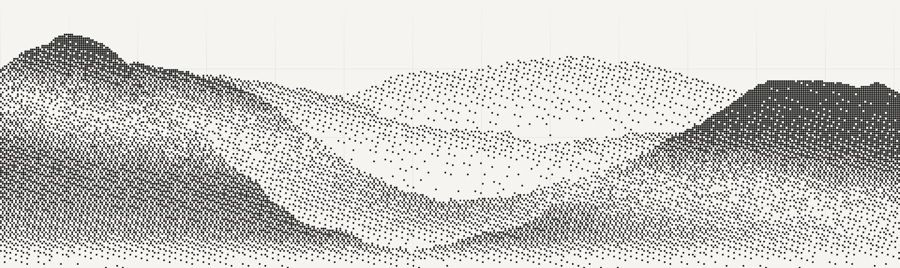
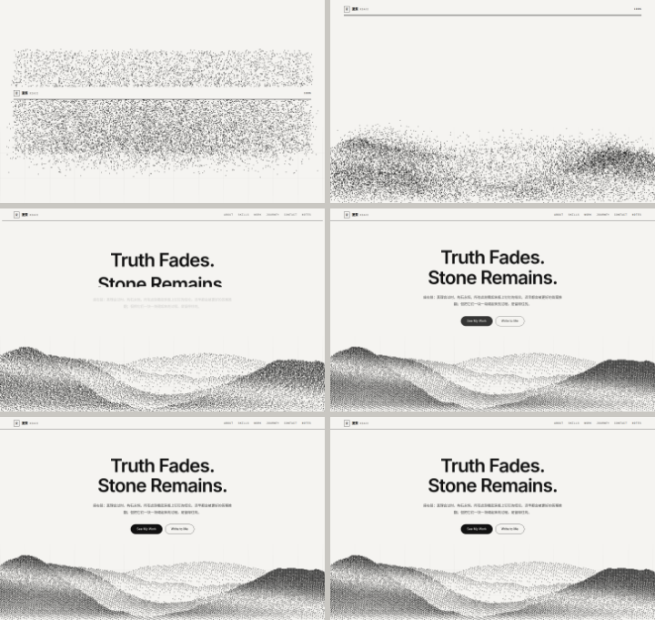
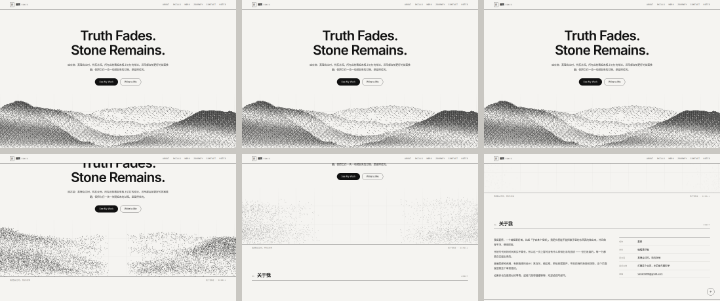

<div align="center">

# 夏祭 · 个人主页

**黑白点阵（dither）风格的极简个人主页 —— 没有一张图片素材，首屏那座山是浏览器现场算出来的。**

[](./LICENSE)
[](./package.json)
[](https://react.dev)
[](https://vite.dev)
[](./CONTRIBUTING.md)



<sub>▲ 上面这张不是截图贴的素材，而是本项目自身代码渲染导出的真实结果：约 1.5 万颗**一样大、一样黑**的圆点按疏密铺成山体（点的位置由分形噪声山脊 + 交错梯度噪声抖动算出）。</sub>

</div>

---

> [!NOTE]
> 这个仓库是我的个人主页。**想拿去做成你自己的？** 直接 fork 或点 Use this template，
> 然后按下面的 [自定义](#自定义) 一节改 `src/data/site.js` 就行 —— 文案、链接、项目全在那一个文件里。

## 目录

- [这是什么](#这是什么)
- [特性](#特性)
- [快速开始](#快速开始)
- [可用命令](#可用命令)
- [项目结构](#项目结构)
- [自定义](#自定义)
- [动效清单](#动效清单)
- [关于留言便签](#关于留言便签)
- [部署](#部署)
- [浏览器支持](#浏览器支持)
- [无障碍与体验](#无障碍与体验)
- [参与贡献](#参与贡献)
- [许可证](#许可证)

## 这是什么

一个可以直接拿来改成自己主页的单页作品集模板。设计语言参考了「编辑排版 / 极简粗野主义」那一类风格：

- 米白底（`#F5F4F1`）+ 近黑墨色（`#111111`），细边框、直角、不用阴影和圆角渐变
- 大字号收紧字距的无衬线标题，配小号等宽字体做标签
- 板块之间用**斜线阴影条**（hatching）分隔，页脚做成**表格状网格**
- 主视觉是灰度点阵/噪点山景，颗粒感来自有序抖动与点的疏密

**技术上的两个刻意取舍：**

1. **零图片素材**。山体是 `src/lib/dither.js` 用数学算出来的：分形噪声生成四层高低错落的山脊，再用交错梯度噪声做抖动，得到每个格子的"墨量"。好处是永远不会有"图裂了"，体积也几乎为零。
2. **山是一片圆点，而且每一颗都一模一样大**。墨量数据被采样成约 1.5 万颗点位（`src/lib/particles.js`），**直径统一、颜色统一**—— 明暗完全由点的**疏密**表现，没有实心色块，也没有大小不一的颗粒。它们负责四种行为：**加载时开场那团无序云 → 归位成山**、**被光标按出一个小坑后慢慢流回**、**滚动时按山的层逐层反向错开**（可逆），以及**静止时一次 fill 画完的零开销**。
3. **不引动画库**。所有动效都是 `IntersectionObserver` + CSS 过渡/rAF 手写的，生产包 gzip 后约 **80 kB**（含 React 本体）。

<div align="center">



<sub>▲ 加载时这 1.5 万个点是**无序散在一条带子里**的 —— 宽度和加载进度条一样、高半屏、垂直居中（就飘在加载界面的纸色底上，不挡进度数字）；加载到 100% 的那一刻开始归位，1.5 秒内一起收拢，在屏幕底部凝聚成山的轮廓</sub>



<sub>▲ 光标扫过：只有它底下那一小圈（直径 76px）被按下去，山的其余部分纹丝不动；移开后点**停在原地慢慢流回**，一点也不晃。下面三帧是下滑时整座山散开 —— 粒子按自己所属的那一层**逐层反向**飞走（最前面那层往左、下一层往右，以此类推），像几张纸片错开滑走</sub>

<sub>上面两张图都由项目自身的代码在浏览器里逐帧截图导出，不是画的。</sub>

</div>

## 特性

- 🏔 **程序化山体** —— 分形噪声 + 交错梯度噪声抖动算出墨量，零图片素材
- ⚪ **统一大小的圆点阵** —— 约 1.5 万颗一样大、一样黑的圆点（桌面端 3~4px 一格），明暗只由**疏密**表现，轮廓从稀疏里读出来
- 🎬 **开场无序云 → 归位成山** —— 加载期间点无序散在一条"和进度条等宽、半屏高、居中"的带子里，加载到 100% 的瞬间开始收拢，1.5 秒内在屏幕底部凝聚成山的轮廓（带一点过冲）
- 🌬 **光标按坑** —— 只有光标底下那一小圈（半径 38px）被按下去，移开后点慢慢流回原位，全程不过冲、不余振
- 💨 **滚动时逐层错开** —— 下滑时粒子按所属的山层**逐层反向**飞走（最前那层往左、往后依次右 / 左 / 右），像几张纸片错开滑走；滚回顶部**像素级复原**（可逆）
- 🖱 **自定义圆圈光标** —— 跟手小黑点 + 带惯性拖尾的圆环，悬停时放大
- ⬆ **回到顶部** —— 右下角一颗圆形箭头，滚过一段距离才出现，点一下平滑滚回顶部；并且**刷新一律从顶部开始**（不这样做的话，停在页面中间刷新会把开场那团点被滚动进度整片淡掉，加载界面上就一颗点都没有）
- 🎭 **加载条长成页眉** —— 开场时页眉就是屏幕底部那根加载条（左边品牌、右边 `000 → 100%`、底下一条进度线，粒子云飘在它周围），进度满的那一刻它**不滑走，而是整体上移停进页眉的位置**，随后进度条向两端延伸成通栏细线、百分比淡出、导航链接淡入；之后就是普通吸顶页眉。整个过程用的是同一个 DOM 元素，所以交接那一帧没有任何跳动
- 🗂 **嵌进章节的粒子图形 + 箭头导航** —— 主内容宽度跟屏幕长（最宽 1680px）；**左侧那列文字选项已经取消**，导航改成**屏幕两侧的左右箭头**（到头循环）+ **固定在屏幕底部的一条细线**（上面那一段表示当前在第几章，里面不写字），键盘 ←/→ 也能切。每个章节在面板里显示"中文大字 + 小号英文 + 细线"的标题。**每个章节里留了一块空白（留白穴），位置各不相同**（中右 / 右上 / 左上 / 左中 / 右下 / 左下），粒子图形就嵌在那块空白里；切板块时图形从一个穴飞到另一个穴（`≤1279px` 放不下就不留空白、图形也藏起来）。点页眉链接、键盘方向键、`#about` 这类锚点都能切，地址栏跟着变（刷新/分享能直达某一栏）
- ✨ **图形由粒子聚出来** —— 每个板块有自己的几何图形（人像 / 阶梯 / 浏览器窗口 / 时间轴 / 信封 / 便签），全部用代码画、再按点阵采样成 6000 颗点；**换板块时这些点直接"挪"成新形状**（约 1 秒，不先散开再重聚），形状看着是在流动变形。它和首屏那座山互不干扰，落定后同样不占帧
- ✨ **滚动揭示** —— 进入视口淡入上浮，逐条错落出现
- 📊 **技能条生长 + 数字滚动**、**卡片悬停 3D 倾斜**、**按钮从左侧填充**
- 📝 **留言便签墙** —— 100 字上限、存在浏览器本地、可单条撕掉
- 📱 **完整响应式** —— 桌面 / 平板 / 手机：≤1279px 时撤掉留白穴、右侧图形整块隐藏，内容摊回一列；手机上箭头收小贴边；粒子格子按屏幕面积自适应
- ♿ **尊重系统设置** —— 开启「减少动态效果」后完全不建粒子，直接显示同一套点阵的静态图
- 🧰 **开箱即用的工程化** —— ESLint 10 + Prettier + CI + Pages 自动部署 + Dependabot

## 快速开始

需要 **Node.js 20.19 以上（推荐 22 LTS）**（仓库带 `.nvmrc`，装了 nvm 的话先 `nvm use`）。

```bash
# 克隆
git clone https://github.com/Xiaji-yu/xiaji-home.git
cd xiaji-home

# 安装依赖
npm install

# 启动开发服务器
npm run dev
```

打开终端里打印的地址即可（默认 http://127.0.0.1:5173/）。改代码会自动热更新，不用重启。

## 可用命令

| 命令                   | 作用                                                  |
| ---------------------- | ----------------------------------------------------- |
| `npm run dev`          | 启动开发服务器（热更新）                              |
| `npm run build`        | 生产构建，产物在 `dist/`                              |
| `npm run preview`      | 本地预览构建产物                                      |
| `npm run lint`         | ESLint 检查                                           |
| `npm run lint:fix`     | ESLint 自动修复                                       |
| `npm run format`       | Prettier 格式化全仓库                                 |
| `npm run format:check` | 只检查格式，不改文件（CI 用）                         |
| `npm run check`        | `lint` + `format:check` + `build`，**提 PR 前跑这个** |

## 项目结构

```
xiaji-home/
├─ index.html                  页面外壳、字体引入、浏览器标签图标（内联 SVG）
├─ vite.config.js              Vite 配置（含 GitHub Pages 的 BASE_PATH 支持）
├─ eslint.config.js            ESLint 扁平配置
├─ .prettierrc.json            代码风格：2 空格 / 单引号 / 不加分号
├─ .github/
│  ├─ workflows/ci.yml         推送与 PR 时跑 lint + 格式 + 构建
│  ├─ workflows/deploy-pages.yml  自动部署到 GitHub Pages
│  ├─ ISSUE_TEMPLATE/          问题模板（bug / 功能建议）
│  └─ PULL_REQUEST_TEMPLATE.md
├─ docs/                       README 里用到的三张效果序列图
│  ├─ preview-mountain.png       静止时的点阵山
│  ├─ preview-assemble.png       载入汇聚
│  ├─ preview-mouse.png          光标按坑与慢慢流回 + 滚动逐层错开
└─ src/
   ├─ main.jsx                 入口
   ├─ App.jsx                  板块顺序，想调整页面结构就改这里
   ├─ data/site.js             ★ 全站文案，改内容只改这一个文件
   ├─ lib/dither.js            山景算法：噪声 + 抖动（决定"山长什么样"、点放哪儿）
   ├─ lib/particles.js         粒子：采样、开场无序云、归位、光标按坑（纯函数，可离线渲染验证）
   ├─ lib/figures.js           六个板块的几何图形（全部代码画，不引图片）
   ├─ lib/figureParticles.js   右侧那个图形的粒子：抽稀/补齐、配对、变形（纯函数）
   ├─ hooks/                   useReveal / useInView / useCountUp
   ├─ styles/
   │  ├─ tokens.css            设计变量：颜色、字体、间距、缓动曲线
   │  └─ base.css              全局排版、按钮、分节标题、斜线条、揭示动画
   └─ components/              每个板块一个组件，各自带同名 CSS
      ├─ Header / Cursor        页眉（开场时是屏幕底部那根加载条）、自定义光标
      ├─ BackToTop              右下角的回到顶部（一个向上的箭头）
      ├─ Hero / ParticleMountain  首屏 + 那片粒子山
      ├─ Sections               板块区：主内容（单栏）+ 嵌在留白穴里的粒子图形 + 两侧箭头 + 底部条
      ├─ FigureCanvas           右侧那个图形：换板块时粒子直接变形挪成新形状
      ├─ About / Skills / Projects / Timeline
      ├─ Contact / Notes / Footer
      └─ Reveal.jsx             滚动淡入的包装组件
```

## 自定义

### 换文案（最常做的事）

**只改 `src/data/site.js`。** 姓名、座右铭、技能、项目、经历、联系方式、页脚链接全在里面，那六章的顺序与中英文名（`sectionTabs`：中文名 + 英文标签 + 对应板块的 id）也在里面。文件里凡是标了 `← 换成你的` 的地方都是占位内容。

想调整板块的先后顺序，改 `src/data/site.js` 里 `sectionTabs` 那六项的顺序（面板本身跟着走）。

### 换右侧那块粒子图形

每个板块的图形是 `src/lib/figures.js` 里一个几十行的小函数 —— 都画在一个 100×100 的归一化画布里（`fillRect` / `arc` / 路径），由 `FigureCanvas` 按 5px 的格子采样成一颗颗点。

- 想让某个板块换个样子：改对应的那个函数即可（比如 `contact` 现在是信封）；想调它在画布里的落点，改同一个文件里的 `PLACEMENT`（`scale` 是占画布的比例，`dx/dy` 是偏移 —— 六个位置刻意错开，换板块时才有平移感）
- 想调点阵粗细：`components/FigureCanvas.jsx` 顶部的 `CELL`（格子边长）、`DOT`（点直径 = 格子 × 它）、`COUNT`（粒子数）、`MORPH`（位移时长与错峰）
- 想调它的大小/位置：`components/Sections.css` 里 `.tabs__inner` 的 `--fig-w`（默认 `min(58vh, 720px)`，`.tabs__figure` 直接用它）和 `.tabs__figure` 的 `right`（默认往右挪出画布宽的 7%，挪的是图形右边那圈空白，不会切到墨点）；它是**背景层**，正文压在它上面
- **"一章一屏"怎么算**：`tokens.css` 里的 `--header-h`（页眉 56px）与 `--status-h`（首屏状态栏高，`App.jsx` 会量出来写回），每章高度 = `100vh − 两者`；`base.css` 的 `scroll-padding-top` 也用这两个值，所以跳转时那条线正好压在页眉线上。想改章节高度就动这两个变量（矮屏上另有 `max-height: 980px / 820px` 两档紧凑规则）
- 想调板块宽度：`components/Sections.css` 的 `--col-w`（默认 `clamp(620px, 82vw, 1680px)`）；两边留白由 `--pad-x` 与那条 `max-width` 一起决定（板块在屏幕上居中）。箭头和底部条也在同一个文件（`.tabs__arrow` / `.tabs__bar`）
- 六章现在的留白穴：关于我·中右（正文 + 信息表 : 图形 ≈ 6 : 4）· 技能栈·右上 · 项目作品·左上 · 经历·左中 · 联系方式·右下 · 便签·左下
- 想挪某一块的留白穴：同一个文件里找 `.pane--about` / `--skills` / `--work` / `--journey` / `--contact` / `--notes`，改那几行的 `grid-column` / `grid-row` 即可（穴的大小是 `--slot-w`）；想让某一块的图形大一点小一点：改那个面板里的 `data-fig-scale`（0.82~1.0）
- `lib/figureParticles.js` 里的配对用的是**空间填充曲线（Morton 序）**：两边按同一套序号排一遍再一一对应 —— 别改成"每颗点找最近的格子"，那样会让新图形大半格子分不到粒子（详见 CHANGELOG）

### 换配色 / 字体

改 `src/styles/tokens.css`：

```css
:root {
  --paper: #f5f4f1; /* 页面底色 */
  --ink: #111111; /* 文字与描边 */
  --muted: #8a8782; /* 次要信息 */
  --sans: 'Inter', ...;
  --mono: 'JetBrains Mono', ...;
}
```

把 `--paper` 和 `--ink` 两个值换掉，整站跟着变。字体是在 `index.html` 里通过 Google Fonts 引入的；如果打不开它，页面会自动回退到系统字体，不会排版崩坏。想彻底不联网，删掉那三行 `<link>` 即可。

### 换掉点阵山景的样子

`src/lib/dither.js` 顶部的 `LAYERS` 就是"山"本身：

```js
{ ridgeTone: 1.0, baseTone: 0.34, falloff: 0.5, noise: 0.08,
  seed: 151, freq: 3.0, amp: 0.09,
  peaks: [[0.86, 0.09, 0.2], [0.72, 0.88, 0.24]] }
//        └山头高度 └中心 └宽度  —— 左右各一座山头
```

- `ridgeTone` 山脊线上（轮廓最上面那一排）的墨量 —— 决定这道轮廓有多清楚；`baseTone` 是这一层最靠下时还剩多少墨量
- `falloff` 从山脊往下淡出的快慢。越大，"实心剪影"越薄、往下越快变稀；最前面那层取 0.5，于是山脊以下一大片是压实的
- `noise` 是山脊以下的岩石颗粒，`amp` 是山脊的破碎程度，`seed` 换个数字就是完全不同的山形
- `peaks` 里每项是 `[山头高度, 中心位置, 宽度]`，`高度: 0` 是平地、`0.86` 代表山脊顶到画面上方 14% 处；四层从远到近排，越靠后越浅

再往下一点还有几个整体参数：`MIST` / `MIST_WIDTH`（山谷里那道斜着的亮雾带）、
`BOTTOM_FADE` / `BOTTOM_START`（最底部淡出）、`BOTTOM_LIGHTEN`（越靠下越亮的空气透视）、
`DOT_FACTOR`（点的直径 = 格子边长 × 它，**这个值决定了"深色能不能压实"**）。

改完直接看效果，不需要跑构建。

### 调整粒子的手感

`src/lib/particles.js` 顶部的常量：

| 常量                              | 作用                                                                                                               |
| --------------------------------- | ------------------------------------------------------------------------------------------------------------------ |
| `AREA_PER_CELL`                   | 一格大约占多少平方像素 —— 决定点的**密度**（屏幕越大格子越大，密度不变）                                           |
| `CELL_MIN` / `CELL_MAX`           | 格子边长的上下限（3~4 CSS 像素）。**调小 = 点更小更密**（点的直径 = 格子 × `DOT_FACTOR`）                          |
| `MOUSE_RADIUS` / `MOUSE_PUSH`     | 光标那个小坑的半径（默认 38px）与最深推距（默认 26px）                                                             |
| `MOUSE_CURL`                      | 推开时的切向旋转分量（0 = 纯径向弹开；坑小，0.15 就够）                                                            |
| `MOUSE_FOLLOW`                    | 跟着光标走的速度（越大坑的边缘越利落）                                                                             |
| `RETURN_RATE`                     | 点流回原位有多慢（默认每帧 4.5%，也就是一秒回流 94%）—— 这里刻意不用弹簧，位移只朝目标做指数收敛，所以永远不会过冲 |
| `INTRO_MS`                        | 开场多长（默认 2000ms：粒子散成尘雾 + 加载条走到 100%，**也是页眉那根加载条的时长**）                              |
| `SETTLE_MS` / `SETTLE_STAGGER_MS` | 归位的总时长 / 点与点之间的错峰（两者相减就是单个点的飞行时长）                                                    |

散开的"力度、方向、淡出、缩小"在 `particleTransform()` 里；绘制方式（圆点、按透明度
分 10 桶、每桶一次并集填充 —— 静止时所有点都在同一个桶里，于是整座山只需一次 `fill`）
在 `components/ParticleMountain.jsx` 的 `draw()` 里。

> 这两个文件里的数学都是**纯函数**（不碰 DOM、不碰 canvas），所以可以直接在 Node 里
> 逐帧跑一遍再渲染成图片来对着调 —— 仓库开发时就是这么验证效果的：山形、点的直径、
> 无序云、归位、按坑与回流、滚动，都是先离线渲染确认过才提交的。
> 归位之所以是"只改偏移"而不是"重新算位置"，就是为了让画布从"铺满视口"收回山景那一块时
> 那一帧的画面完全不变（见 `ParticleMountain.jsx` 顶部的坐标换算说明）。

## 动效清单

| 动效                                           | 在哪实现                                                                                                                           |
| ---------------------------------------------- | ---------------------------------------------------------------------------------------------------------------------------------- |
| **加载条上移、长成页眉**                       | `components/Header.jsx`（sticky 元素 + 加载期间的 translateY）                                                                     |
| 纸色遮罩上滑离场                               | 同上（`.load-bg`）                                                                                                                 |
| **开场那团点无序漂浮**                         | `components/ParticleMountain.jsx` + `lib/particles.js`                                                                             |
| **加载结束瞬间开始归位（1.5 秒内成山）**       | 同上（错峰 + `easeOutBack` 在 `lib/particles.js`）                                                                                 |
| **光标按坑 + 慢慢流回（不过冲）**              | 同上（一阶滞后在 `lib/particles.js` 的 `stepParticles()`）                                                                         |
| **滚动时按山层逐层反向散开（可逆）**           | 同上（方向在 `lib/particles.js` 的 `buildParticles()` 里定）                                                                       |
| **换板块时图形从一个留白穴飞到另一个穴**       | `components/FigureCanvas.jsx`（`slotBox()` 量穴）+ `lib/figureParticles.js`（配对与插值）；穴的位置在 `Sections.css` 的 `.pane--*` |
| **换板块时正文逐条入场（内容先到、粒子后到）** | `components/Sections.css` 的 `.tabs.is-armed` + `panelIn`（图形延后在 `FigureCanvas.jsx` 的 `SWITCH_DELAY_MS`）                    |
| **左侧选中竖线滑到下一项**                     | `components/Sections.jsx` 的 `useLayoutEffect` + `Sections.css` 的 `.tabs__ind`                                                    |
| **左下角大号幽灵字交叉淡入**                   | `components/Sections.jsx` 的 `mark` 状态 + `Sections.css` 的 `.tabs__mark-i`                                                       |
| 自定义圆圈光标                                 | `components/Cursor.jsx`                                                                                                            |
| 右下角回到顶部按钮                             | `components/BackToTop.jsx`（滚过 420px 才出现）                                                                                    |
| 首屏大标题逐行推入                             | `Hero.css` 的 `@keyframes heroLine`                                                                                                |
| 山景与标题的鼠标视差                           | `components/Hero.jsx`（rAF + 插值 → CSS 变量 → `.mountain`）                                                                       |
| 滚动淡入上浮                                   | `components/Reveal.jsx` + `hooks/useReveal.js`                                                                                     |
| 按钮 / 联系方式卡片左侧填充                    | `base.css` 的 `.btn::before`、`Contact.css`                                                                                        |
| 技能条生长 + 数字滚动                          | `components/Skills.jsx` + `hooks/useCountUp.js`                                                                                    |
| 项目卡片 3D 倾斜                               | `components/Projects.jsx`                                                                                                          |
| 页脚斜线阴影条流动                             | `base.css` 的 `@keyframes hatchFlow`                                                                                               |

## 关于留言便签

便签存在**访问者自己的浏览器**里（`localStorage`，键名 `xiaji-notes-v1`）：

- 刷新、关闭重开都还在；单条最多 100 字；最多存 60 张；点 `×` 可撕掉
- **别人看不到你写的，你也看不到别人写的** —— 因为这是纯静态页面，没有服务器
- 想做成真正多人共享的留言板，需要加一个后端（Supabase / Cloudflare Workers 等），那是另一个工程

清空全部便签：浏览器 F12 → Application → Local Storage → 删掉 `xiaji-notes-v1`。

## 部署

> 仓库是**私有**的，主线托管走 **Cloudflare Workers（静态资源）**：免费版支持私有仓库，
> 构建跑在 Cloudflare 侧，推 `main` 就自动发布。
> GitHub Pages 只在公开仓库、或 Pro/Team/Enterprise 的私有仓库上可用 —— 公开仓库转私有时
> GitHub 会**自动下线**已发布的 Pages 站点，所以 `.github/workflows/deploy-pages.yml`
> 已改名成 `.yml.disabled`（留着备查，升了 Pro 想切回来，把后缀改回 `.yml` 即可）。

**当前线上地址**：<https://xiaji-home.variant305.workers.dev>

### Cloudflare Workers（当前使用）

在 Cloudflare 控制台 **Workers & Pages → Create → Connect to Git** 连上这个仓库，
它会自己识别出这是 Vite 项目并配好：

| 项       | 值                                                |
| -------- | ------------------------------------------------- |
| 构建命令 | `npm run build`                                   |
| 输出目录 | `dist`                                            |
| Node     | 22（仓库 `.nvmrc`；Vite 8 要求 Node ≥ 20.19）     |
| 部署     | `npx wrangler deploy`（把 `dist` 当静态资源发布） |

它在构建沙箱里会补一份 `wrangler.jsonc`（`assets.not_found_handling = "single-page-application"`）
和 `deploy` / `preview` 两个脚本 —— 这些**只存在于 Cloudflare 侧，没有提交进仓库**。
想让配置显式、可复现（比如以后在自己机器或别的 CI 上 `npx wrangler deploy`），
把那份 `wrangler.jsonc` 提交进来即可。

自定义域名：Cloudflare 控制台里给这个 Worker 加 **Custom domain** 就行。

### Cloudflare Pages / Vercel / Netlify（备选托管）

想要 `*.pages.dev` 之类的地址，或者换个平台：新建一个 Pages 项目（或直接把这个仓库导入
Vercel / Netlify），构建设置同样是「`npm run build` / 输出 `dist` / Node 22」，
都不需要 `BASE_PATH`（站点在根路径上，`vite.config.js` 默认就是 `/`）。

### GitHub Pages（需要公开仓库或 Pro 以上）

1. 把 `.github/workflows/deploy-pages.yml.disabled` 改回 `deploy-pages.yml`
2. 仓库 **Settings → Pages → Build and deployment → Source** 选 **GitHub Actions**
3. 推到 `main` 就会自动构建发布，地址是 `https://<用户名>.github.io/<仓库名>/`

> 项目页的资源路径前缀必须带仓库名。工作流里已经用
> `BASE_PATH=/${{ github.event.repository.name }}/` 自动处理了，对应的读取逻辑在 `vite.config.js`。
> 如果你用的是「用户主页仓库」（仓库名形如 `<用户名>.github.io`），把工作流里那行 `BASE_PATH` 删掉即可。

## 浏览器支持

面向所有支持 ES2020 与 `IntersectionObserver` 的现代浏览器：Chrome / Edge 90+、Firefox 88+、Safari 14+。

两处自动降级：

- 触屏设备（没有鼠标）会自动关闭自定义光标与视差，避免留下一个卡住的圆圈
- 格子边长按屏幕面积自适应：桌面端 3~4px 一格（约 1.5 万颗点），手机 3px 一格；点的大小永远跟着格子走，所以疏密层次是一致的

## 无障碍与体验

- 完整响应 `prefers-reduced-motion: reduce`：所有动画与过渡被压到近乎瞬时（延时也一起清掉），开场直接跳过（页眉一开始就在位、进度直接 100%），**粒子系统完全不构建** —— 改用同一套点阵算法画出来的静态图，长得和粒子版一样，只是不会飞
- 自定义光标只在 `(pointer: fine)` 且未开启减少动效时启用才会隐藏系统光标
- 保留键盘可见焦点环；导航、卡片、按钮都有 `aria-label` 或可读文本
- 语义化标签（`header` / `main` / `section` / `footer` / `article` / `dl`）
- 静止时粒子系统不占用任何帧 —— 主循环在动画停稳后会自行停下，画布保留最后一帧；归位结束、滚回顶部且鼠标移开后开销为零
- 粒子层是 `aria-hidden` 的纯装饰，不影响读屏；鼠标交互只在有精确指针的设备上启用
- 山体的本体就是这些点（除了"有没有点"以外不携带任何信息），所以即使脚本半途出错，静态点阵图也仍可作降级显示

如果你发现无障碍方面的问题，欢迎开 issue。

## 参与贡献

欢迎 PR 和 issue —— 请先读 [CONTRIBUTING.md](./CONTRIBUTING.md)，行为准则见 [CODE_OF_CONDUCT.md](./CODE_OF_CONDUCT.md)，安全问题请按 [SECURITY.md](./SECURITY.md) 私下报告。

> 只是想换成自己的主页？**不用提 PR**，直接 fork 到你自己仓库里改就行。

## 许可证

[MIT](./LICENSE) © 2026 夏祭 (Xiaji)

代码可以随意使用、修改、商用，保留版权声明即可。
页面里的**个人文案、姓名、联系方式不属于授权范围**，请替换成你自己的内容再发布。
